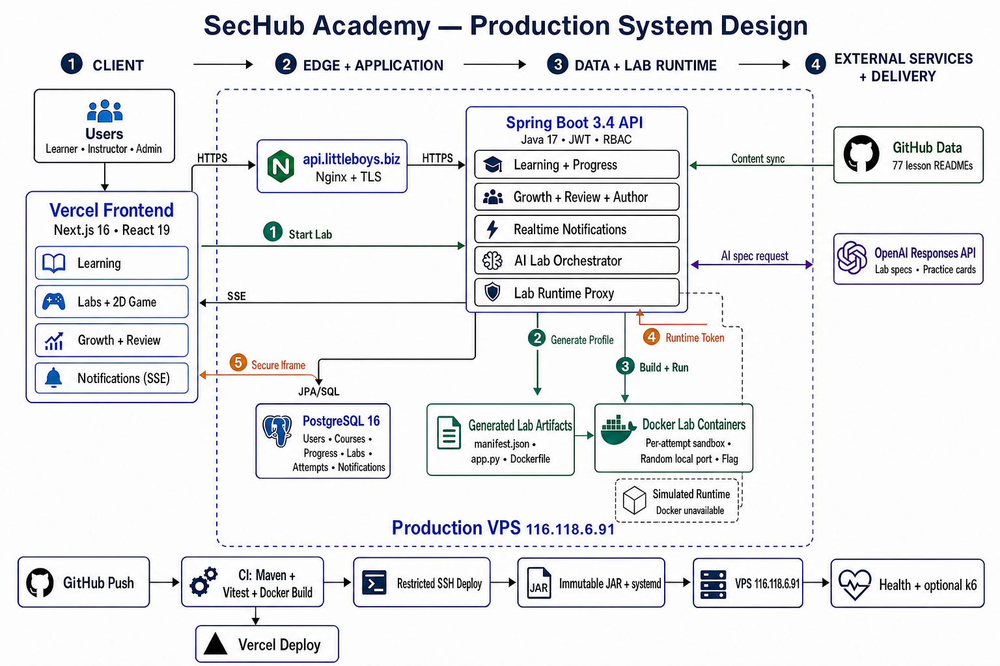
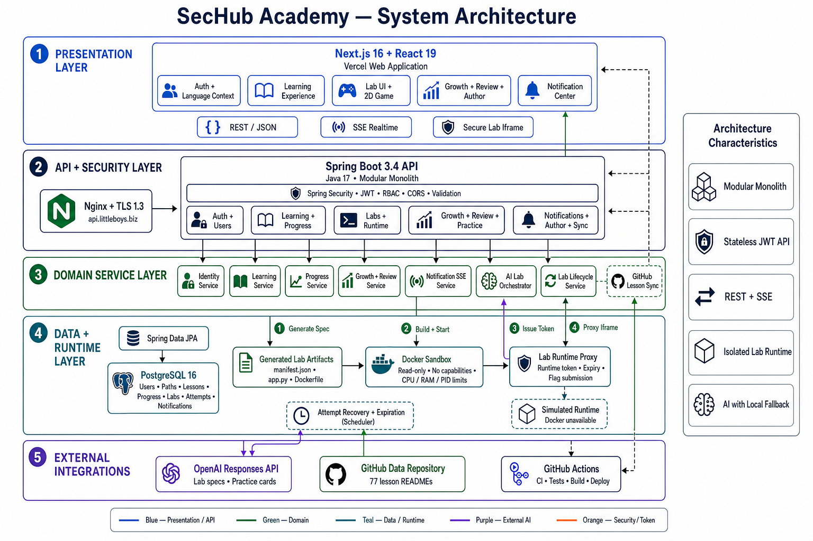

# SecHub Academy

[](https://github.com/Little-Boy-s-SecHub/SecHub/actions/workflows/ci.yml)
[](https://sechub-academy.vercel.app/)
[](https://api.littleboys.biz/actuator/health)
[](https://developers.openai.com/api/docs/guides/latest-model?model=gpt-5.6)

SecHub Academy is a full-stack web penetration testing learning platform. It combines structured security lessons with isolated, hands-on labs so learners can study a vulnerability, launch a vulnerable target, exploit it, submit a flag, and receive progress and review feedback in one workflow.

- Live application: [sechub-academy.vercel.app](https://sechub-academy.vercel.app/)
- Production API health: [api.littleboys.biz/actuator/health](https://api.littleboys.biz/actuator/health)
- Learning content: [Little-Boy-s-SecHub/Data](https://github.com/Little-Boy-s-SecHub/Data)
- Hackathon: [OpenAI Build Week](https://openai.devpost.com/resources)

## Mission

Learning web application security should not stop at reading theory. SecHub connects a bilingual security knowledge base with practical labs for vulnerability classes such as SQL Injection, Cross-Site Scripting, CSRF, SSRF, IDOR, authentication failures, cryptographic failures, and API security.

The platform is designed around a continuous learning loop:

1. Read a focused lesson.
2. Launch or generate a related lab.
3. Exploit the vulnerable application in an isolated runtime.
4. Submit the flag and receive a score.
5. Review weak topics through practice cards and follow-up labs.

## What SecHub Includes

- Bilingual English and Vietnamese lesson content synchronized from the `Data` repository.
- Standard lab UI and an optional 2D game mode.
- Per-attempt lab lifecycle, runtime token, timer, hints, flag validation, scoring, mentor guidance, and feedback.
- AI-assisted lab generation from lesson topics and author-provided scenarios.
- Local deterministic lab specifications when the OpenAI request is unavailable or invalid.
- Growth profiles, activity history, leaderboards, review cards, daily labs, and weekly challenges.
- Author tools for drafting and publishing learning paths, lessons, and labs.
- Database-backed notifications delivered in realtime through Server-Sent Events.
- Per-user notification preferences. Disabled notifications are not created, listed, or streamed for that user.
- GitHub Actions for linting, tests, coverage, application builds, container builds, and production deployment.

## System Design

The production topology is split across the Vercel frontend, the public API edge, the Spring Boot application on a VPS, PostgreSQL, isolated lab runtimes, and external content and AI services.



### Production Request Path

1. The browser loads the Next.js application from Vercel.
2. API traffic is sent over HTTPS to `api.littleboys.biz`.
3. Nginx terminates public TLS and proxies requests to the Spring Boot service on the VPS.
4. Spring Boot applies JWT authentication, RBAC, validation, and CORS policies.
5. Spring Data JPA persists users, content, progress, labs, attempts, activities, review cards, and notifications in PostgreSQL 16.
6. Lab traffic is routed through `/api/lab-runtime/{token}/**` to the active Docker or simulated runtime.

The production backend runs directly on the project VPS. Railway is not part of the current deployment path.

## Software Architecture

SecHub is implemented as a modular Spring Boot monolith with a separate Next.js frontend. Domain services own application behavior, repositories own persistence, and the lab runtime remains behind a token-aware proxy.



### Main Backend Responsibilities

| Area | Responsibility |
|---|---|
| Identity | Registration, login, refresh tokens, users, BCrypt passwords, JWT, and RBAC |
| Learning | Learning paths, lessons, vulnerabilities, lesson synchronization, and progress |
| Labs | Lab catalog, attempts, timers, hints, flags, scoring, feedback, and expiration |
| Runtime | Artifact generation, Docker orchestration, simulated fallback, and reverse proxying |
| Growth | Profiles, activities, tracks, assessments, leaderboards, and harder lab variants |
| Review | Practice cards, spaced review state, daily labs, and weekly labs |
| Authoring | Draft and publish workflows for paths, lessons, and challenges |
| Notifications | Persistent notification records, user preferences, and SSE emitters |
| AI | OpenAI Responses API integration for lab specifications and practice cards |

### Lab Generation and Launch Flow

1. A learner or author requests a lab for a vulnerability or lesson topic.
2. The AI Lab Orchestrator asks the configured OpenAI model for a structured `LabSpec`.
3. The response is parsed and validated. Invalid or unavailable AI output falls back to a local topic-aware specification.
4. SecHub combines the specification with a known challenge profile and creates `manifest.json`, `app.py`, and `Dockerfile` artifacts.
5. Docker builds and starts a per-attempt sandbox with a generated flag. When Docker is unavailable, SecHub serves a simulated runtime.
6. The attempt receives an expiry time and a scoped runtime token.
7. The frontend loads the challenge through the Lab Runtime Proxy in a secure iframe.
8. Flag submission, hints, timing, scoring, cleanup, and attempt recovery remain controlled by the backend.

Docker labs currently use a read-only filesystem, a temporary filesystem, dropped Linux capabilities, `no-new-privileges`, and CPU, memory, and PID limits. Vulnerable lab containers are intentionally unsafe applications and should only be run in a controlled development or training environment.

## How We Used Codex and GPT-5.6

SecHub uses the GPT-5.6 family in two distinct places. GPT-5.6 Sol is the quality-first engineering model used through Codex while building and validating the project. GPT-5.6 Terra is the balanced runtime model used by the application for learner-facing generation.

| Role | Model and surface | How SecHub uses it |
|---|---|---|
| Product engineering | Codex with GPT-5.6 Sol | Repository analysis, implementation, debugging, data validation, testing, review, documentation, and deployment checks |
| Lab generation | OpenAI Responses API with GPT-5.6 Terra | Structured lab metadata, lesson-aware scenarios, hints, time estimates, points, and adaptive lab variants |
| Review generation | OpenAI Responses API with GPT-5.6 Terra | Practice cards derived from completed lesson content |
| Learner coaching | SecHub analytics plus GPT-5.6 Terra content | Skill measurement, weak-topic selection, recommended lessons, and follow-up practice or labs |

Codex and the runtime OpenAI integration are separate. Signing in to Codex does not configure the SecHub backend. The deployed application requires its own API key and model environment variables.

### GPT-5.6 Sol During Development

Codex with GPT-5.6 Sol was used as a repository-aware engineering partner throughout the project:

- Inspected the Next.js frontend, Spring Boot backend, PostgreSQL entities, Docker runtime, CI workflows, and production request path before making changes.
- Checked the `Data` synchronization path, lesson metadata, topic slugs, vulnerability mappings, and generated-lab coverage across the lesson catalog.
- Diagnosed stale Railway URLs, CORS failures, authentication errors, notification behavior, runtime proxy failures, and generated-lab inconsistencies.
- Implemented and reviewed topic-aware lab profiles, generated artifacts, Docker and simulated runtimes, notification SSE behavior, responsive UI fixes, and VPS deployment changes.
- Ran Maven tests, Vitest, ESLint, Next.js production builds, Docker checks, GitHub Actions checks, and production health verification.
- Reviewed Git diffs and cross-checked the implementation against the system design before changes were released.
- Produced the system design, software architecture diagrams, and this project documentation.

Sol was selected for this work because repository-wide debugging and architecture decisions benefit from deeper reasoning, longer context, and stronger code-review judgment. Source control, automated tests, and human review remained the release gates.

### GPT-5.6 Terra Inside SecHub

GPT-5.6 Terra is the intended application model for runtime generation. When a learner creates a lab, SecHub sends the Responses API the lesson title, learning path, lesson content, vulnerability topic, difficulty, language, requested scenario, and learner track.

Terra returns a strict structured `LabSpec` containing:

- A lesson-aware title and description.
- A practical scenario that stays within the isolated SecHub sandbox.
- One or more progressive hints.
- An estimated completion time.
- A point value appropriate for the requested difficulty.

The backend validates this response before using it. SecHub then maps the topic to a known runtime profile, generates a unique flag, creates `manifest.json`, `app.py`, and `Dockerfile`, and starts the Docker or simulated lab runtime. If the API response is missing, invalid, or unavailable, local topic-aware templates keep the lab workflow operational.

Terra also generates review and practice cards from lessons the learner has completed. Daily labs, weekly challenges, and harder variants reuse the same generation pipeline while adding the learner track and previous lab context to the prompt.

### Hints, Feedback, Strengths, and Weaknesses

SecHub combines model-generated teaching content with deterministic learner analytics:

1. GPT-5.6 Terra generates the initial hint sequence as part of the lab specification.
2. During an attempt, SecHub records the score, completion status, hints used, time, vulnerability category, and completed lessons.
3. The Growth service aggregates those records into skill XP, skill level, completed-lab count, and average hint usage.
4. The strongest skill is selected from the highest skill XP, while the weak skill is selected from the lowest skill XP in the available catalog.
5. SecHub recommends an unfinished lesson for the weak topic, or a review of a previously completed lesson when no unfinished lesson remains.
6. That learner context is used to choose the next review cards and to generate Daily, Weekly, or harder lab variants at an appropriate difficulty.

This is intentionally a hybrid design. Lab hints and practice content can be generated by GPT-5.6 Terra, while skill scores and recommendations are grounded in stored user activity rather than model guesses. The current AI Mentor guiding questions and post-lab secure-code feedback are deterministic templates, which keeps them fast and available even when the OpenAI API is offline.

### Runtime GPT-5.6 Configuration

GPT-5.6 is accessed through the OpenAI API; there is no model package to install locally. Create an API key in the [OpenAI API dashboard](https://platform.openai.com/api-keys), keep it out of source control, and expose it to the backend process.

OpenAI documents three GPT-5.6 tiers. The `gpt-5.6` alias routes to `gpt-5.6-sol`; `gpt-5.6-terra` targets lower-cost balanced workloads, and `gpt-5.6-luna` targets efficient high-volume workloads. See the official [GPT-5.6 model guidance](https://developers.openai.com/api/docs/guides/latest-model?model=gpt-5.6).

For SecHub's runtime generation workflow, configure the balanced Terra model:

```dotenv
OPENAI_API_KEY=your-api-key
OPENAI_MODEL=gpt-5.6-terra
OPENAI_BASE_URL=https://api.openai.com/v1
```

The repository currently uses one runtime model setting for both lab specifications and practice cards. The effective model is the value of `OPENAI_MODEL` in the environment where the backend is running. If the variable is not set, the repository default is `gpt-5.6-terra`. A UI label is not proof of the active API model; backend configuration and API response metadata are the source of truth.

SecHub sends requests to the OpenAI Responses API for two runtime workloads:

1. Structured lab specifications, including the scenario, progressive hints, estimated time, and points.
2. Practice and review cards generated from completed lessons.
3. Daily, weekly, and harder lab variants adapted from learner context.

The backend validates generated output before persistence or execution. Local templates remain available as a deterministic fallback so the learning workflow does not depend entirely on a successful AI response.

## Technology Stack

| Category | Technology | Purpose |
|---|---|---|
| Frontend | Next.js 16.2.9, React 19.2.4, TypeScript 5 | App Router web application and bilingual user interface |
| UI | Lucide React, CSS, marked | Icons, responsive application UI, and lesson Markdown rendering |
| Backend | Spring Boot 3.4.4, Java 17 | REST API, validation, scheduling, health checks, and domain services |
| Security | Spring Security, JJWT, BCrypt | Stateless authentication, refresh tokens, and role authorization |
| Persistence | PostgreSQL 16, Spring Data JPA, Hibernate | Users, content, progress, labs, attempts, activities, and notifications |
| Lab Runtime | Docker, Python lab applications | Per-attempt vulnerable targets and generated flags |
| AI | OpenAI Responses API | Lab specifications and practice or review cards |
| Realtime | Server-Sent Events | Notification delivery to signed-in users |
| Content | GitHub API and raw content | Synchronization from the `Data` repository |
| Testing | JUnit, Mockito, Spring Security Test, Vitest, Testing Library, JaCoCo, k6 | Unit, component, coverage, smoke, load, and stress checks |
| Delivery | GitHub Actions, Vercel, Nginx, systemd, VPS | CI, frontend delivery, public TLS, and backend deployment |

## Repository Layout

```text
SecHub/
|-- .github/
|   `-- workflows/                 # CI and production deployment
|-- backend/
|   |-- deploy/                    # Atomic VPS release script
|   |-- runtime/generated-labs/    # Generated lab artifacts
|   |-- src/main/java/com/sechub/
|   |   |-- config/                # Security and application configuration
|   |   |-- controller/            # REST and runtime proxy endpoints
|   |   |-- dto/                   # API request and response contracts
|   |   |-- entity/                # JPA entities
|   |   |-- repository/            # Spring Data repositories
|   |   |-- security/              # JWT and user-details support
|   |   |-- seed/                  # Seed data
|   |   `-- service/               # Domain, AI, notification, and runtime logic
|   |-- src/test/                  # Backend tests
|   |-- Dockerfile
|   `-- pom.xml
|-- docs/
|   |-- sechub-system-design.png
|   `-- sechub-system-architecture.png
|-- frontend/
|   |-- src/app/                   # Next.js routes
|   |-- src/components/            # Shared UI and lab experiences
|   |-- src/context/               # Authentication and language state
|   |-- src/lib/                   # API client
|   |-- src/translations/          # English and Vietnamese strings
|   |-- AGENTS.md                  # Frontend-specific Codex guidance
|   `-- package.json
|-- performance/
|   `-- k6/                        # Smoke, load, and stress tests
`-- README.md
```

## Prerequisites

| Tool | Recommended version |
|---|---|
| Java | 17 |
| Maven | 3.6.3 or newer |
| Node.js | 22 |
| npm | Included with Node.js |
| Docker | Current stable release |
| PostgreSQL | 16, or the Docker image below |

Docker is required for real generated lab containers. Without Docker, SecHub can use its simulated lab runtime for supported artifacts.

## Windows Setup with WSL 2 and Docker Desktop

The recommended Windows development environment is Ubuntu on WSL 2 with Docker Desktop. After this section, run all project commands inside the Ubuntu terminal unless a step explicitly says PowerShell.

### 1. Check the Windows Requirements

Use a supported 64-bit Windows 10 or Windows 11 release with hardware virtualization enabled in BIOS or UEFI. Docker Desktop currently requires at least WSL 2.1.5 and recommends the latest WSL release. See the official [Microsoft WSL installation guide](https://learn.microsoft.com/en-us/windows/wsl/install) and [Docker Desktop Windows requirements](https://docs.docker.com/desktop/setup/install/windows-install/) when using a managed or older Windows installation.

### 2. Install WSL 2 and Ubuntu

Open PowerShell as Administrator and run:

```powershell
wsl --install -d Ubuntu
wsl --update
wsl --set-default-version 2
```

Restart Windows when prompted. Open Ubuntu from the Start menu and create the Linux username and password requested on first launch. The password is not displayed while typing; this is normal.

Return to PowerShell and verify the installation:

```powershell
wsl --version
wsl --list --verbose
```

The Ubuntu row must show version `2`. If it shows version `1`, convert it:

```powershell
wsl --set-version Ubuntu 2
```

If `wsl --install` displays help instead of installing Ubuntu, use `wsl --list --online` and then rerun `wsl --install -d Ubuntu`.

### 3. Install Docker Desktop

Install Docker Desktop from PowerShell:

```powershell
winget install --exact --id Docker.DockerDesktop
```

If `winget` is unavailable, use the installer from the official [Docker Desktop for Windows](https://docs.docker.com/desktop/setup/install/windows-install/) page.

Start Docker Desktop from the Start menu, accept its license, and confirm these settings:

1. In **Settings > General**, enable **Use the WSL 2 based engine** when the option is visible.
2. In **Settings > Resources > WSL Integration**, enable integration for Ubuntu.
3. Use Linux containers. SecHub lab images do not use Windows containers.
4. Select **Apply and restart** after changing a setting.

Do not install a second Docker Engine inside Ubuntu when using Docker Desktop. The Docker Desktop WSL integration provides the Docker CLI and engine to the Ubuntu terminal.

Open Ubuntu and verify that containers run:

```bash
docker version
docker run --rm hello-world
```

Both the Docker client and server must appear in `docker version`. A client-only response usually means Docker Desktop is closed or Ubuntu integration is disabled.

### 4. Install the Development Tools in Ubuntu

Run these commands inside Ubuntu:

```bash
sudo apt update
sudo apt install -y git curl ca-certificates openjdk-17-jdk maven

curl -fsSL https://deb.nodesource.com/setup_22.x | sudo -E bash -
sudo apt install -y nodejs
```

Verify every required tool before cloning SecHub:

```bash
git --version
java -version
mvn -version
node --version
npm --version
docker version
```

Java must report version 17 and Node.js must report version 22. Maven 3.6.3 or newer is supported.

### 5. Keep the Repository in the WSL Filesystem

Store the repository under the Linux home directory instead of `/mnt/c`. This gives Docker bind mounts and Node.js dependency operations better filesystem performance.

```bash
mkdir -p ~/projects
cd ~/projects
git clone https://github.com/Little-Boy-s-SecHub/SecHub.git
cd SecHub
```

Windows can access this directory through `\\wsl$\Ubuntu\home\<your-linux-user>\projects\SecHub`. Editors with WSL support can open the repository directly from the Ubuntu terminal.

## Local Installation

### 1. Clone the Repositories

Skip this step if the repository was already cloned during the Windows WSL setup. On Linux or macOS, clone it now:

```bash
git clone https://github.com/Little-Boy-s-SecHub/SecHub.git
cd SecHub
```

The backend synchronizes lesson content from the public `Little-Boy-s-SecHub/Data` repository, so a separate local clone of `Data` is not required for the normal startup path.

### 2. Start PostgreSQL

```bash
docker run -d \
  --name sechub-postgres \
  -e POSTGRES_DB=sechub_db \
  -e POSTGRES_USER=postgres \
  -e POSTGRES_PASSWORD=change-me \
  -p 127.0.0.1:5432:5432 \
  postgres:16
```

Confirm that PostgreSQL is running:

```bash
docker ps --filter name=sechub-postgres
docker logs --tail 20 sechub-postgres
```

On later development sessions, reuse the same database instead of creating another container:

```bash
docker start sechub-postgres
```

### 3. Configure the Backend

Copy the example environment file:

```bash
cd backend
cp .env.example .env
nano .env
```

Update the values before starting the backend:

```dotenv
PORT=8888
SPRING_DATASOURCE_URL=jdbc:postgresql://localhost:5432/sechub_db
SPRING_DATASOURCE_USERNAME=postgres
SPRING_DATASOURCE_PASSWORD=change-me
JWT_SECRET=replace-with-at-least-32-random-characters
SYNC_TOKEN=replace-with-a-random-sync-token
CORS_ALLOWED_ORIGIN_PATTERNS=http://localhost:3000
OPENAI_API_KEY=your-api-key
OPENAI_MODEL=gpt-5.6-terra
OPENAI_BASE_URL=https://api.openai.com/v1
LAB_GENERATED_ROOT=./runtime/generated-labs
```

Generate separate local values for `JWT_SECRET` and `SYNC_TOKEN` with `openssl rand -base64 48`. In `nano`, press `Ctrl+O`, Enter, and `Ctrl+X` to save and close the file. The OpenAI key is required for GPT-5.6 Terra generation; without it, the application still starts and supported labs use deterministic local templates.

Spring Boot does not automatically import a generic `.env` file. Load these variables into the current Bash shell before starting the backend:

```bash
set -a
source .env
set +a
mvn spring-boot:run
```

The backend starts at `http://localhost:8888`. Health is available at `http://localhost:8888/actuator/health`. Leave this process running and open another Ubuntu terminal for the frontend.

### 4. Configure and Start the Frontend

In the new terminal, enter the frontend directory. The first command below uses the recommended WSL clone location; use the equivalent path if the repository was cloned elsewhere.

```bash
cd ~/projects/SecHub/frontend
npm ci
```

Create `frontend/.env.local`:

```bash
printf '%s\n' 'NEXT_PUBLIC_API_BASE_URL=http://localhost:8888/api' > .env.local
```

Start the development server:

```bash
npm run dev
```

Open `http://localhost:3000`.

### 5. Verify the Local Application

Keep Docker Desktop and both application processes running:

| Process | Where it runs | Required state |
|---|---|---|
| PostgreSQL | Docker Desktop background container | Listed by `docker ps` |
| Spring Boot API | First Ubuntu terminal in `SecHub/backend` | `mvn spring-boot:run` remains active |
| Next.js frontend | Second Ubuntu terminal in `SecHub/frontend` | `npm run dev` remains active |

Check both applications before registering a user:

```bash
curl --fail http://localhost:8888/actuator/health
curl --head http://localhost:3000
```

The backend response must contain `"status":"UP"`, and the frontend request must return an HTTP success response. Open `http://localhost:3000`, register an account, select a lesson, and start a lab.

### Local Troubleshooting

| Problem | Resolution |
|---|---|
| `docker: command not found` in Ubuntu | Enable Ubuntu under Docker Desktop **Settings > Resources > WSL Integration**, apply the change, and reopen the Ubuntu terminal. |
| Cannot connect to the Docker daemon | Start Docker Desktop, wait until the engine reports that it is running, then retry `docker version`. |
| WSL or Docker remains stuck after an update | Close Docker Desktop, run `wsl --shutdown` in PowerShell, and start Docker Desktop again. |
| Container name `sechub-postgres` is already in use | Run `docker start sechub-postgres`; do not create a second container with the same name. |
| Port `5432`, `8888`, or `3000` is already in use | Stop the conflicting process or container. Use `docker ps` and `ss -ltnp` inside Ubuntu to identify it. |
| Backend cannot connect to PostgreSQL | Confirm the database container is running and that the datasource password matches `POSTGRES_PASSWORD`. |
| Backend does not see values from `.env` | Load the file into the current shell with `set -a; source .env; set +a` before running Maven. |
| AI generation falls back to local templates | Confirm `OPENAI_API_KEY`, `OPENAI_MODEL`, and outbound network access in the backend process. |

## Using SecHub

1. Register a learner account or sign in.
2. Select a learning path and open a lesson.
3. Start an existing lab or request an AI-generated lab for the lesson topic.
4. Choose Standard UI or 2D Game Mode.
5. Inspect the vulnerable application, use hints when needed, and submit the flag before the attempt expires.
6. Review the score and feedback, then continue through Growth, Review, or the next lesson.
7. Use Profile and Leaderboard views to track activity and progress.
8. Users with author permissions can create and publish paths, lessons, and labs from the Author workspace.

## Testing and Verification

### Frontend

```bash
cd frontend
npm run lint:ci
npm run test
npm run test:coverage
npm run build
```

### Backend

```bash
cd backend
mvn test
mvn verify
```

Run the configured 70 percent JaCoCo coverage profile when expanding backend coverage:

```bash
mvn -Pcoverage verify
```

### Performance

Install [k6](https://grafana.com/docs/k6/latest/set-up/install-k6/) and run from the repository root:

```bash
k6 run performance/k6/smoke.js
k6 run -e VUS=20 performance/k6/load.js
k6 run performance/k6/stress.js
```

The k6 scripts use read-only learner and catalog endpoints. They do not create AI labs, start containers, or submit flags.

## Production Deployment

SecHub is already deployed in production:

- Frontend: [https://sechub-academy.vercel.app](https://sechub-academy.vercel.app)
- Backend API: [https://api.littleboys.biz/api](https://api.littleboys.biz/api)
- Backend health: [https://api.littleboys.biz/actuator/health](https://api.littleboys.biz/actuator/health)
- Backend host: VPS `116.118.6.91`
- Public TLS: Nginx and Let's Encrypt
- Database: PostgreSQL 16 on the VPS
- Lab runtime: Docker containers on the VPS with a simulated fallback

The production request path is `Browser -> Vercel -> api.littleboys.biz -> Nginx -> Spring Boot -> PostgreSQL or Lab Runtime`. Railway is not used.

### Production Prerequisites

The current deployment expects:

- A Linux VPS with Java 17, Maven 3.6.3 or newer, Git, Docker, Nginx, and Certbot.
- A DNS record for `api.littleboys.biz` pointing to the VPS.
- A Vercel project connected to the `SecHub` repository with `frontend` as its root directory.
- A systemd service named `sechub-backend`.
- A PostgreSQL 16 database reachable only from the VPS.
- GitHub Actions production secrets for the restricted SSH deployment identity.

Install the host packages on Ubuntu before continuing:

```bash
sudo apt update
sudo apt install -y openjdk-17-jdk maven git docker.io nginx certbot python3-certbot-nginx
sudo systemctl enable --now docker nginx
```

Keep ports `8888` and `5432` private. The public firewall should normally allow only SSH, HTTP, and HTTPS.

### 1. Prepare PostgreSQL on the VPS

Create a persistent volume and bind PostgreSQL only to the loopback interface:

```bash
docker volume create sechub-postgres-data

docker run -d \
  --name sechub-postgres \
  --restart unless-stopped \
  -e POSTGRES_DB=sechub_db \
  -e POSTGRES_USER=postgres \
  -e POSTGRES_PASSWORD=replace-with-a-strong-password \
  -p 127.0.0.1:5432:5432 \
  -v sechub-postgres-data:/var/lib/postgresql/data \
  postgres:16
```

### 2. Prepare the Backend Repository

```bash
sudo git clone https://github.com/Little-Boy-s-SecHub/SecHub.git /opt/SecHub
sudo mkdir -p /opt/sechub/releases
sudo mkdir -p /opt/SecHub/backend/runtime/generated-labs
sudo useradd --system --home /opt/SecHub --shell /usr/sbin/nologin sechub
sudo usermod -aG docker sechub
sudo chown -R sechub:sechub /opt/SecHub/backend/runtime
```

If the `sechub` account already exists, skip the `useradd` command. The service account must be able to write to the generated-lab directory and execute Docker. Group membership changes take effect for the next service process started by systemd.

### 3. Configure the Production Backend Environment

Create `/etc/sechub-backend.env` with production values:

```dotenv
PORT=8888
SPRING_DATASOURCE_URL=jdbc:postgresql://127.0.0.1:5432/sechub_db
SPRING_DATASOURCE_USERNAME=postgres
SPRING_DATASOURCE_PASSWORD=replace-with-a-strong-password
JWT_SECRET=replace-with-a-long-random-secret
SYNC_TOKEN=replace-with-a-long-random-sync-token
CORS_ALLOWED_ORIGIN_PATTERNS=https://sechub-academy.vercel.app,https://*.vercel.app
OPENAI_API_KEY=your-production-openai-api-key
OPENAI_MODEL=gpt-5.6-terra
OPENAI_BASE_URL=https://api.openai.com/v1
LAB_GENERATED_ROOT=/opt/SecHub/backend/runtime/generated-labs
```

Protect the environment file:

```bash
sudo chown root:root /etc/sechub-backend.env
sudo chmod 600 /etc/sechub-backend.env
```

### 4. Configure systemd

Create `/etc/systemd/system/sechub-backend.service`:

```ini
[Unit]
Description=SecHub Backend
After=network-online.target docker.service
Wants=network-online.target
Requires=docker.service

[Service]
Type=simple
User=sechub
Group=sechub
WorkingDirectory=/opt/SecHub/backend
EnvironmentFile=/etc/sechub-backend.env
ExecStart=/usr/bin/java -jar /opt/sechub/current.jar
Restart=always
RestartSec=5
SuccessExitStatus=143

[Install]
WantedBy=multi-user.target
```

Enable the service after the first JAR has been deployed:

```bash
sudo systemctl daemon-reload
sudo systemctl enable sechub-backend
```

### 5. Deploy the First Backend Release

The repository includes `backend/deploy/deploy-vps.sh`. It builds the JAR, stores an immutable release under `/opt/sechub/releases`, updates `/opt/sechub/current.jar` atomically, restarts systemd, and waits for the local health endpoint.

```bash
cd /opt/SecHub
sudo bash backend/deploy/deploy-vps.sh
curl --fail http://127.0.0.1:8888/actuator/health
```

### 6. Configure Nginx and TLS

Use Nginx as the only public entry point to Spring Boot. Save the server block as `/etc/nginx/sites-available/api.littleboys.biz`:

```nginx
server {
    listen 80;
    server_name api.littleboys.biz;

    location / {
        proxy_pass http://127.0.0.1:8888;
        proxy_http_version 1.1;
        proxy_set_header Host $host;
        proxy_set_header X-Real-IP $remote_addr;
        proxy_set_header X-Forwarded-For $proxy_add_x_forwarded_for;
        proxy_set_header X-Forwarded-Proto $scheme;
        proxy_buffering off;
        proxy_read_timeout 3600s;
    }
}
```

Enable the site and issue the certificate:

```bash
sudo ln -sfn /etc/nginx/sites-available/api.littleboys.biz /etc/nginx/sites-enabled/api.littleboys.biz
sudo nginx -t
sudo systemctl reload nginx
sudo certbot --nginx -d api.littleboys.biz
```

The long proxy timeout and disabled response buffering allow the notification SSE stream to remain open.

### 7. Configure the Production Frontend

Import the GitHub repository into Vercel and set the project root directory to `frontend`. The frontend is deployed through Vercel Git integration whenever `main` receives a successful update.

Set the production environment variable:

```dotenv
NEXT_PUBLIC_API_BASE_URL=https://api.littleboys.biz/api
```

The production URL used by this project is `https://sechub-academy.vercel.app`.

### 8. Configure GitHub Actions Deployment

Create a GitHub environment named `production` and configure:

| Secret or variable | Required | Purpose |
|---|---|---|
| `VPS_SSH_PRIVATE_KEY` | Yes | Private key for the restricted backend deployment identity |
| `VPS_HOST` | Optional | VPS address; the workflow defaults to `116.118.6.91` |
| `VPS_USER` | Optional | Restricted SSH user; the workflow defaults to `sechub-deploy` |
| `K6_USERNAME` | Optional | Production smoke-test account |
| `K6_PASSWORD` | Optional | Production smoke-test password |

The deployment key should be restricted to the SecHub deploy command instead of providing a general interactive shell. The workflow starts after the `CI` workflow succeeds on `main`.

### 9. Production Release Flow

After CI succeeds, the production workflow uses a restricted SSH deployment identity to update the VPS. The backend deployment script:

1. Builds the Spring Boot JAR.
2. Copies it into `/opt/sechub/releases` with an immutable timestamped name.
3. Atomically updates `/opt/sechub/current.jar`.
4. Restarts the systemd service.
5. Waits for the public actuator health endpoint.
6. Waits for the Vercel Git deployment.
7. Verifies the frontend URL.
8. Runs an optional k6 smoke test when production test credentials exist.

Production secrets belong in the GitHub `production` environment or the VPS service environment. Do not commit API keys, database passwords, JWT secrets, sync tokens, Vercel tokens, or SSH keys.

### 10. Production Verification

```bash
curl --fail https://api.littleboys.biz/actuator/health
curl --fail https://sechub-academy.vercel.app/
```

The expected backend response includes `"status":"UP"`. Check backend logs with:

```bash
sudo journalctl -u sechub-backend -n 100 --no-pager
```

## API Overview

| Prefix | Purpose |
|---|---|
| `/api/auth` | Registration, login, and token refresh |
| `/api/users` | Current user, profile, dashboard, activities, and preferences |
| `/api/learning-paths` | Learning path catalog and lessons |
| `/api/lessons` | Lesson details |
| `/api/progress` | Lesson and path completion |
| `/api/vulnerabilities` | Vulnerability catalog and related labs |
| `/api/labs` | Lab catalog, attempts, hints, flags, feedback, and lifecycle |
| `/api/lab-runtime/{token}` | Token-scoped proxy to an active lab runtime |
| `/api/ai` | AI-assisted lab generation |
| `/api/growth` | Assessments, profiles, activity, tracks, and leaderboard |
| `/api/review` | Review dashboard, cards, and daily labs |
| `/api/practice` | Practice decks and practice labs |
| `/api/author` | Author workspace and publishing operations |
| `/api/notifications` | Notification list, read state, and SSE stream |
| `/api/sync` | Protected lesson-content synchronization |

## Security Notes

- Never run intentionally vulnerable lab applications on an unrestricted public host.
- Keep PostgreSQL and dynamic lab ports behind host firewall rules.
- Use a long, random JWT secret and rotate it through deployment configuration.
- Restrict CORS to known frontend origins in production.
- Treat generated artifacts as untrusted input and keep Docker resource and capability restrictions enabled.
- Store OpenAI and deployment credentials only in environment variables or managed secret stores.
- Review Codex-generated diffs and test evidence before merging or deploying them.

## Project Repositories

| Repository | Purpose | Primary stack |
|---|---|---|
| [SecHub](https://github.com/Little-Boy-s-SecHub/SecHub) | Frontend, backend API, AI orchestration, lab runtime, tests, and deployment | TypeScript, Java, Python, Docker |
| [Data](https://github.com/Little-Boy-s-SecHub/Data) | English and Vietnamese vulnerability lessons and security references | Markdown |
